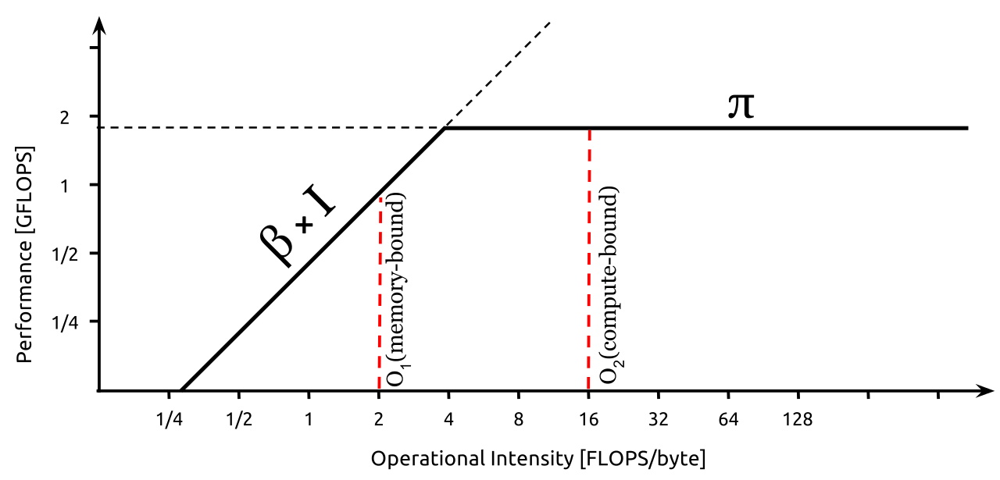
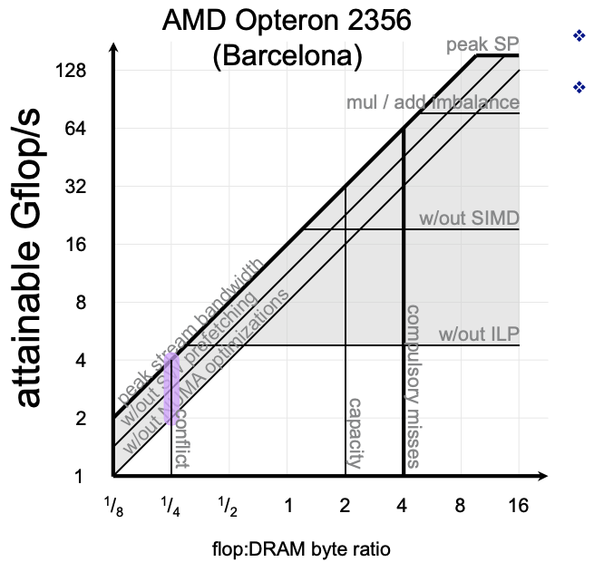
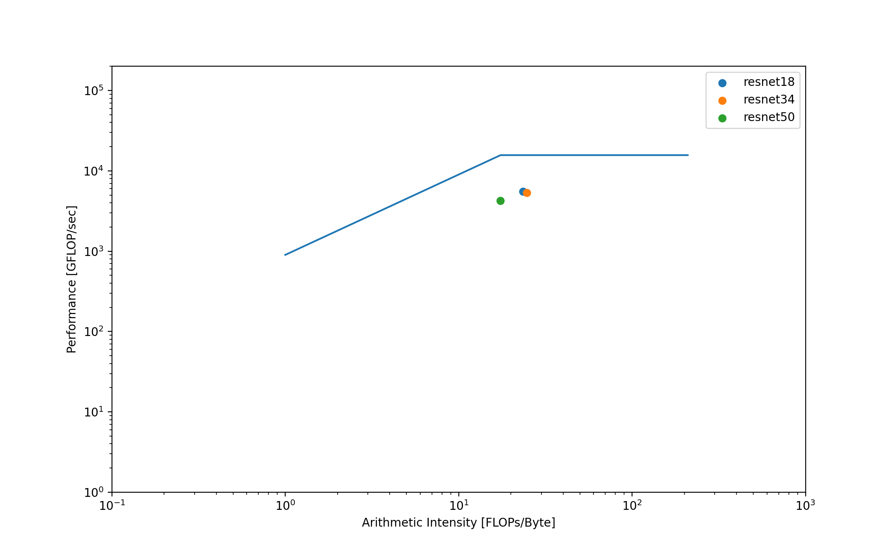
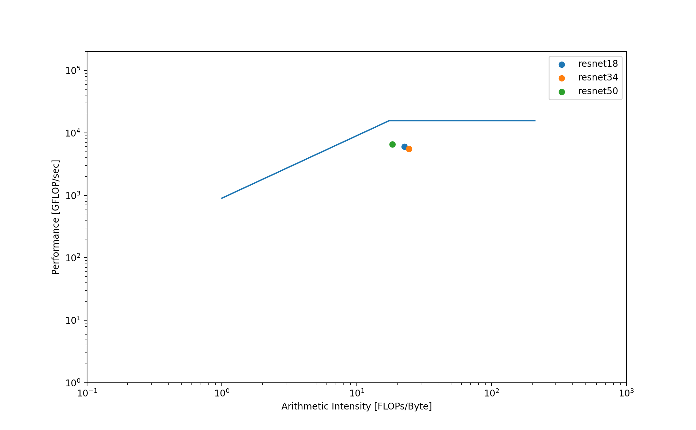

# Project 1 - Roofline Modeling

[toc]

## Introduction

Performance is a crucial topic in the chip industry. From the designer's point of view, aside from the clock frequency, there are many critical factors to consider to boost the actual performance. From the application level, programmers care about the performance because the utilization of CPU/GPU largely determines the development efficiency and cost. This report introduces a graphic representation tool  -- roofline model -- for programmers to understand the performance of their programs and goes through an experiment to see how the roofline model illustrates the performance on different GPU and convolutional neural networks.

### Roofline Modeling Introduction

Roofline models intend to provide a graphical aid to evaluate the CPU/GPU performance. It shows programmers the performance they should expect based on three components of performance: **computation, communication, and locality**. It plots the theoretical performance boundary of the training as a "roofline" shape to show the boundary effects of the three components. **It provides programmers with ideas to optimize their codes.**

The roofline model is unique to each kernel since the architecture affects the efficiency of the three components. For each neural network structure, which is a point on the graph, its performance is relevant to how well the structure exploits the kernel. 

#### Basic (Naive) roofline

```
Gflop/s = min {peak flop/s, Bandwidth * actual flop/s}
```



**Note**:

1. X-axis is operational intensity: the computations required for unit size of an image
2. Y-axis is performance (flop/s): the achievable computations for unit time
3. &pi; is the peak flop/s. Clearly, the performance cannot be better than the theoretical statistics
4. &beta; x I represents the memory boundary. Computations are proportional to the fed-in data. 
5. The axis is log-scaled. So for linear function `total computations = bandwidth * arithmetic intensity`, the graph will have slope 1 and non-zero intercept


#### Hierarchical roofline model



<center>Figure 1: Hierarchical Roofline Model (adapted from reference 2)<center/>

**Note**:

1. Rather than the idealist scenario, there will be performance restrictions (ceilings).
2. the horizontal lines represent the performance ceiling of *Computation*, especially parallelism
3. the slope lines represent the memory ceiling of *Communication* (transferring speed from memory to cache)
4. the vertical line represents the limitation of *locality*

The hierarchical Roofline Model provides factors in multiple dimensions, but it is also *complicated*. This report mainly focuses on the simple roofline model.


## Experiments

Note: all scripts and codes are shared on [Github](https://github.com/CharlleChen/NYU-Cloud-and-Machine-Learning/tree/main/project1)

### Theoretical evaluation with Paper and Pen

Before giving a hypothesis, we first go through some basic facts about our target GPU and neural networks. This report will use two commonly seen GPU in data centers: NVIDIA V100 and NVIDIA A100. For the neural network, we choose the family of convolutional neural networks, ResNet to be specific. The report will experiment with ResNet18, ResNet34, and ResNet50 to see their performance difference.

#### GPU Specs

##### NVIDIA V100<sup>[4]</sup>

 Peak computation speed (FP32): 15.7 TFLOPS

 Peak memory bandwidth (HBM2): 900GB/sec

 Minimum operational intensity for peak computation speed:

   Peak computation speed / Peak memory bandwidth  &#8776; **17.4 FLOP /Bytes**

 Memory: 4GB

##### NVIDIA A100<sup>[5]</sup>

 Peak computations speed (FP32): 19.5 TFLOPS

 Peak memory bandwidth (HBM2): 1555 GB/sec

 Minimum operational intensity for peak computation speed:

   Peak computation speed / Peak memory bandwidth  &#8776; **12.5 FLOP /Bytes**

 Memory: 4GB

#### Neural nets

Input image size: 224 x 224 x 3 x 4 bytes = 602,112 bytes &#8776; 0.6 MB

Neural nets: ResNet 18, RestNet 34, ResNet 50

Mentioned in assignment 3, convolutional layers dominate computations and the bulky part can be calculated as `kernel_size x kernel_size x input_channel x output_size^2 x output_channel`

##### ResNet18

| Kernel size | Input channel | Output channel | Output shape | Repetitions | Computation   |
| ----------- | ------------- | -------------- | ------------ | ----------- | ------------- |
| 7           | 3             | 64             | 112          | 1           | 118013952     |
| 3           | 64            | 128            | 28           | 4           | 231211008     |
| 3           | 128           | 256            | 14           | 4           | 231211008     |
| 7           | 256           | 512            | 7            | 4           | 1258815488    |
|             |               |                |              | **Total**   | 1,839,251,456 |

FLOPS: 1.8 x 10^9

##### ResNet34

| Kernel size | Input channel | Output channel | Output shape | Repetitions | Computation   |
| ----------- | ------------- | -------------- | ------------ | ----------- | ------------- |
| 7           | 3             | 64             | 112          | 1           | 118013952     |
| 3           | 64            | 128            | 28           | 8           | 462422016     |
| 3           | 128           | 256            | 14           | 12          | 693633024     |
| 7           | 256           | 512            | 7            | 6           | 1888223232    |
|             |               |                |              | **Total**   | 3,162,292,224 |

FLOPS: 3.1 x 10^9

##### Pytorch ResNet FLOPS and Operational/Arithmetic Intensity

The following GFLOPS of models are adopted from PyTorch website<sup>[6]</sup>

The image size is computed by the dimension (224 * 224 *3), with each element occupying 8 bits:

 224 * 224 * 3 * 1 byte &#8776; 150 MB

| Architecture | GFLOPS | Image size (MB) | Operational Intensity (FLOPS/Byte) |
| ------------ | ------ | --------------- | ---------------------------------- |
| ResNet18     | 1.8    | 150             | **12.0**                           |
| ResNet34     | 3.6    | 150             | **24.0**                           |
| ResNet50     | 3.8    | 150             | **25.3**                           |

Note: the manual calculations of ResNet34 are off the correct answer a little bit. ResNet50 has more biases

### Hypothesis

1. On V100, ResNet34, and ResNet50 will have better performance than ResNet18 because ResNet18 has a lower Operational Intensity than the minimum threshold to utilize peak GPU performance
2. On A100, three models will attain comparable performance because the operational intensity threshold is smaller than any of them
3. A100 will have better overall performance than V100

Note: ResNet18 and ResNet34 has really similar structures while ResNet50 has a more complicated one<sup>[6]</sup>.


### Procedures

1. Clone the [official example codes](https://github.com/pytorch/examples/tree/master/imagenet) of PyTorch training on ImageNet

2. Modify the code to make the training halt at `print_freq` steps (specifically, add `break` in the block of`if i % args.print_freq == 0:`) and skip the validation process (add `continue` after training)

3. Use `ncu` tool to profile the total **FLOPS** and **memory throughput** with metrics below

   ```bash
   dram__sectors_write.sum
   dram__bytes_write.sum.per_second
   dram__sectors_read.sum
   dram__bytes_read.sum.per_second
   smsp__sass_thread_inst_executed_op_fadd_pred_on.sum
   smsp__sass_thread_inst_executed_op_fmul_pred_on.sum
   smsp__sass_thread_inst_executed_op_ffma_pred_on.sum
   ```

4. Use `nsys` tool to profile the **total runtime**

5. Calculate **Operational Intensity (or Arithmetic Intensity)** and **attainable flop per second** with:

```bash
flop_count_sp = 
  smsp__sass_thread_inst_executed_op_fadd_pred_on.sum +   
  smsp__sass_thread_inst_executed_op_fmul_pred_on.sum + 
  smsp__sass_thread_inst_executed_op_ffma_pred_on.sum * 2
AI = flop_count_sp / ((dram_read_transactions + dram_write_transactions)*32)
flop/s = flop_count_sp / gpu_runtime
```


### Result

#### Table

| GPU       | V100                                     |                                      | A100                                     |                                      |
| --------- | ---------------------------------------- | ------------------------------------ | ---------------------------------------- | ------------------------------------ |
| **Model** | **Operational Intensity (flops / byte)** | **Attainable computation (Gflop/s)** | **Operational Intensity (flops / byte)** | **Attainable computation (Gflop/s)** |
| ResNet18  | 23.46                                    | 5.56                                 | 22.60                                    | 6.06                                 |
| ResNet34  | 24.74                                    | 5.36                                 | 24.43                                    | 5.54                                 |
| ResNet50  | 17.41                                    | 4.28                                 | 18.38                                    | 6.53                                 |

<center>Table 1: attainable performance of RestNet on V100 and A100</center>

##### Observations:

###### Operational Intensity

  1. Operational Intensity should be solely dependent on model architecture and independent of GPU architecture. They show different magnitude, but they are within reasonable ranges
  2. ResNet18 has higher Operational Intensity than theoretical values. This may be caused by the overhead of model training (e.g. loading the model parameters to cache). The FLOP of the model is relatively small, so the result is more likely to be influenced by the overhead.
  3. ResNet 50 has lower operational intensity than the other two. This is inconsistent with our theoretical calculations. This may be relevant to the architecture. Since ResNet50 has some special CNN layer, like 1x1 convolutions, there may be some optimizations by GPU. Also, since there are more model parameters, even though this means more FLOPS for the model, it causes the memory bandwidth to increase, which may however decrease the FLOP/bandwidth ratio.

###### Attainable Computation

  1. A100 generally has greater attainable computation for ResNet
  2. ResNet50 has lower attainable computation on V100 but a higher attainable computation on A100. This means that ResNet50 can exploit the potential of A100 better. Or in other words, A100 are more optimized for ResNet50, even though it has a lower operational intensity

#### Roofline Graphs



<center>Graph 1: roofline model for V100</center>

##### Observations

Though the actual operational intensity is unpredicted, this is a perfect illustration of the roofline model: ResNet50 has obvious poorer performance than the other two because its operational intensity is lower than the minimum operational intensity threshold to maximize the GPU's potential. ResNet18 and ResNet34 have comparable performance because their difference in operational intensity makes no change to attainable performance once passing the threshold



<center>Graph 2: roofline model for A100</center>

However, the threshold of A100 is lower, so the training of ResNet50 on A100 is not restricted by the memory bandwidth. So, it can have decent performance. Nevertheless, this graph cannot explain why there is decreasing performance when operational intensity increases, but the difference is not conspicuous.

### Discussions

The actual operational intensity is unexpected, but the relationship between operational/arithmetic intensity, attainable flop per second, and the ridge point for peak performance is demonstrated in this experiment. **With three models of increasing operational intensity, when they are trained on different GPUs with different specs, their order of performance is different because of the existence of ridge point.** This validates the roofline model

Though showing a good demonstration of roofline models, there are some obvious drawbacks to this experiment. For instance, there is a gap between the attained performance and peak performance even if the operational intensity passes the threshold. Here are some discussions:

- GPU misleading statistics:
  - Manufacturers tend to maximize their benefit by manipulating the figures. For instance, the 15.7 and 19.5 TFLOP/S are measured with "boosted clock rate" (clarified in a small line in the specs). Therefore, the peak computation and memory bandwidth are just for reference and can never achieve.
  - Using Empirical Roofline Toolkit (ERT) to do microbenchmark on the GPU, as in the previous experinements<sup>[3]</sup>,  should give better approximations, but the profiling takes painfully long to complete.
- Tool usages
  - This experiment uses NVIDIA GPU toolboxes to measure the metrics and running time, but it involves more delicate details about their implementations, which do not return the exact things we want. For instance, the experiment uses the tool `nsys` in the Nsight System, which is the recommended toolbox, to trace cuda time. Though, using `nvprof`, which comes from an older version of cuda toolbox and is deprecated in high-end GPUs (like A100), gives inconsistent results as the ones measured by `nsys`.
  - There are much more things that happen under the hood. Getting finer estimation requires further knowledge about GPU and CUDA.
- Limitations of simple roofline model
  - Since we only consider the peak performance and memory bandwidth, which is too ideal, the actual computation involves more factors, such as GPU parallelism, various levels of caching. These factors are further considered in the hierarchical roofline model.
- Limited time of training
  - For the sake of simplicity and time saving, the experiment only runs the training for a minimum time (10 steps for 10 batches). As a result, the overhead may occupy a large portion of the performance, obfuscating the real performance.


## Conclusions

This report goes through the performance visualizing tool roofline and conducts experiments on two different GPU architectures and three correlated Convolutional Neural Networks with the simple roofline model. The result reveals the expressiveness of the model, but it also shows that the simple roofline model lacks some insights into reality.

## References

1. The original paper of roofline model: [Roofline: An Insightful Visual Performance Model for Multicore Architectures](https://dx.doi.org/10.1145/1498765.1498785)
2. The very first presentation sharing the roofline model: [ The Roofline Model: A pedagogical tool for program analysis and optimization](https://crd.lbl.gov/assets/pubs_presos/parlab08-roofline-talk.pdf)
3. A comprehensive guide to creating hierarchical roofline model: [Hierarchical Roofline Analysis: How to Collect Data using Performance Tools on Intel CPUs and NVIDIA GPUs](https://arxiv.org/pdf/2009.02449.pdf)
4. V100 Specs: [NVIDIA TESLA V100 GPU ARCHITECTURE](https://images.nvidia.com/content/volta-architecture/pdf/volta-architecture-whitepaper.pdf)
5. A100 Specs: [NVIDIA A100 TENSOR CORE GPU ](https://www.nvidia.com/content/dam/en-zz/Solutions/Data-Center/a100/pdf/nvidia-a100-datasheet-us-nvidia-1758950-r4-web.pdf)
6. Pytorch ResNet: [RESNET](https://pytorch.org/hub/pytorch_vision_resnet/)


